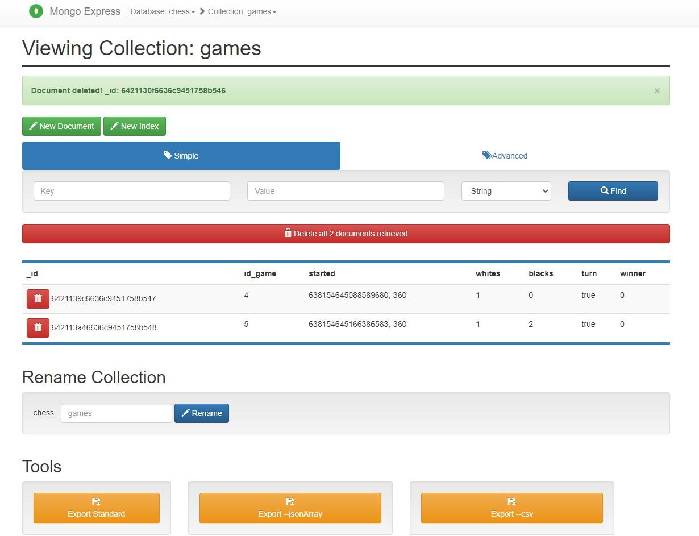
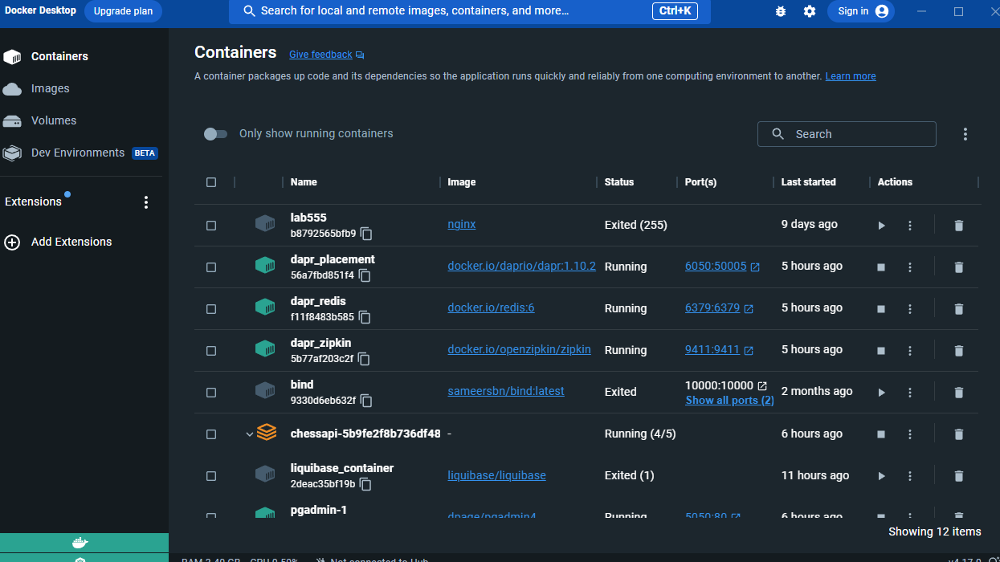
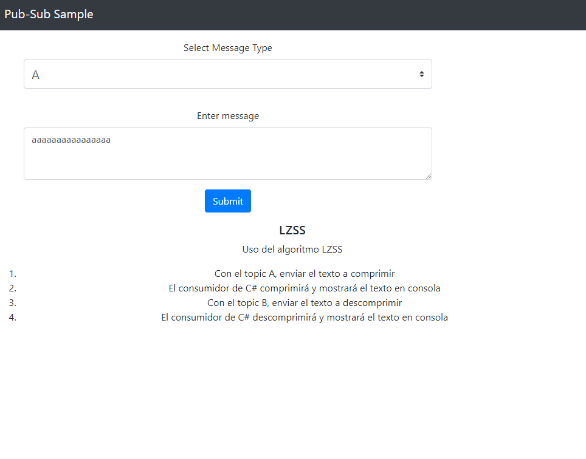
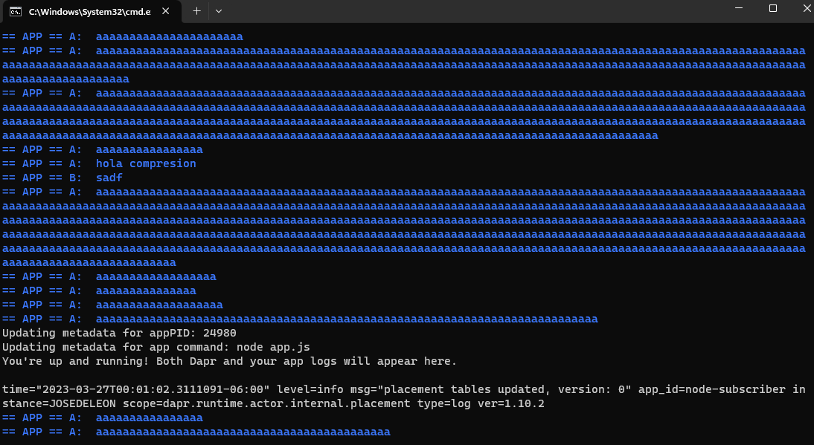

# ChessAPI-HT
Hoja de Trabajo
José Vinicio De León
1072619

## Implementación de Mongo
Se configuró los servicios necesarios para permitir el almacenamiento en mongo.

## Implementación de PubSub
Se utilizó el quickstart de Dapr para incializar la comunicación productor-cosumidor entre las distintas apis.

React-Form funjió como productor, publicando al resto de servicios la información ingresada.

La publicación realizada por esta aplicación era recibida por todos los servicios suscritos a el.

### LZSS
Se reutilizó el siguiente algoritmo
https://github.com/opensource-apple/kext_tools/blob/master/compression.c

El resultado comprimido en la API de dotnet se mostraba de la siguiente manera.

